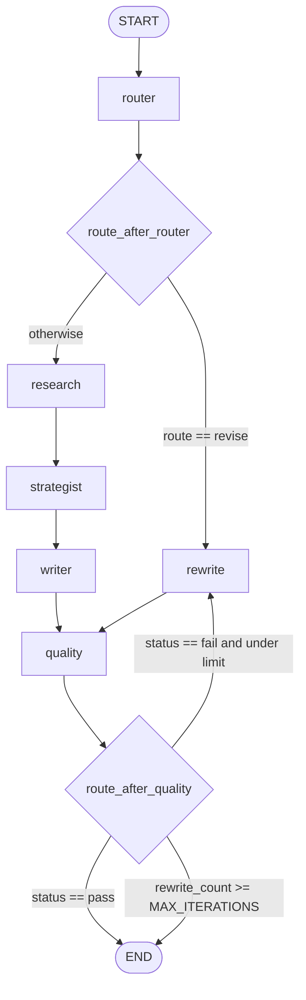

# AI Content Marketing Assistant

## Project Overview

AI Content Marketing Assistant is a production-style AI engineering project that orchestrates research, strategy, drafting, quality control, and revision through a typed LangGraph workflow. It is built to demonstrate reliable multi-step LLM systems: schema-validated state, deterministic fallbacks, citation-safe content generation, and offline-first tests.

The current implementation is optimized for LinkedIn content creation and revision. It combines live research collection through SerpAPI with structured OpenAI Responses API calls for summarization, strategy, writing, and rewriting, while enforcing deterministic quality gates before final output.

## Key Features

- Multi-step LangGraph workflow for research, strategist, writer, quality, and rewrite stages
- SerpAPI-backed source discovery with normalization and URL deduplication
- OpenAI Responses API integrations that enforce JSON outputs for structured agent responses
- Pydantic model validation for `ResearchPacket`, `ContentBrief`, `Draft`, and `QualityReport`
- Deterministic quality checks for CTA presence, skimmability, word limits, headline length, and citation usage
- Safe rewrite loop with fallback behavior and post-processing that preserves citation hygiene
- Streamlit UI that supports both create and revise workflows
- Offline, deterministic pytest suite with mocked external integrations

## Architecture Overview

The system is modeled as a LangGraph state machine. The default path runs `research -> strategist -> writer -> quality`. If the router receives a revise intent, the graph jumps directly into the rewrite path. If quality fails, the graph loops through rewrite until the draft passes or `MAX_ITERATIONS` is reached.



Workflow stages:

- `research`: queries SerpAPI, normalizes sources, and produces a schema-valid research packet
- `strategist`: turns research findings into a structured `ContentBrief`
- `writer`: generates a LinkedIn-ready `Draft` constrained by allowed citations
- `quality`: applies deterministic heuristics to approve or reject the draft
- `rewrite`: revises a failing draft using targeted fixes, then loops back into quality

## Tech Stack

- `LangGraph` for workflow orchestration and state transitions
- `OpenAI Responses API` for strategist, writer, research summarization, and rewrite JSON generation
- `SerpAPI` for external web research
- `Pydantic` and `pydantic-settings` for schema validation and environment configuration
- `Streamlit` for the interactive create/revise UI
- `pytest` for deterministic test coverage
- `uv` for environment and dependency management
- Python 3.11

## Repository Structure

```text
.
├─ src/
│  ├─ agents/         # LangGraph node implementations for router, research, strategy, writing, quality, and rewrite
│  ├─ app/            # application config, shared models, and typed workflow state
│  ├─ integrations/   # OpenAI Responses API and SerpAPI client wrappers
│  ├─ ui/             # Streamlit application entrypoint
│  ├─ utils/          # text and time helpers
│  └─ workflow/       # graph assembly and routing helpers
├─ evals/             # offline eval harness, metrics, schemas, and generated result reports
├─ tests/             # deterministic offline unit tests
├─ docs/              # architecture and graph documentation
├─ plans/             # implementation milestone notes
├─ .env.example       # example environment configuration
├─ pyproject.toml     # project metadata and dependencies
└─ uv.lock            # locked dependency set for uv
```

## Setup Instructions

This repository uses `uv` for dependency management and command execution.

```bash
uv sync
```

If you prefer to run without syncing first, `uv run ...` will also resolve and execute commands on demand.

## Environment Variables

Create a `.env` file in the repository root. The application reads settings automatically via `pydantic-settings`.

Required or commonly used variables:

- `OPENAI_API_KEY`
- `OPENAI_MODEL`
- `SERPAPI_API_KEY`
- `MAX_ITERATIONS`
- `DEFAULT_PLATFORM`
- `DEFAULT_TONE`

Example:

```env
OPENAI_API_KEY="your_openai_key"
OPENAI_MODEL="gpt-4"
SERPAPI_API_KEY="your_serpapi_key"
MAX_ITERATIONS=2
DEFAULT_PLATFORM="linkedin"
DEFAULT_TONE="professional"
```

## Running Tests

Run the full deterministic unit test suite:

```bash
uv run pytest -q
```

The default suite is designed to run offline. External API calls are mocked in unit tests.

## Running Evals

Run the deterministic offline eval harness against the golden suite:

```bash
uv run python -m evals.harness --suite golden --fail-on-threshold
```

By default this writes reports to `evals/results/latest.json` and `evals/results/latest.md`.

## Running the Streamlit UI

Launch the local UI with:

```bash
uv run streamlit run src/ui/streamlit_app.py
```

The app provides a simple interface for generating a new draft or revising the most recent draft.

## Usage

### Create Workflow

Use the `Run new draft` action to execute the full content generation pipeline:

1. Research the topic with SerpAPI
2. Summarize and structure the findings
3. Build a strategic brief
4. Generate a LinkedIn draft
5. Run the quality gate
6. Rewrite automatically if needed

### Revise Workflow

Use the `Revise last draft` action to iterate on the existing result:

1. Reuse the prior draft and supporting context
2. Apply a user-provided revision request
3. Run the rewrite node
4. Re-check quality and loop until pass or max iterations

## Design Principles

- Schema validation first: every structured agent output is validated with Pydantic before re-entering graph state
- Deterministic tests: unit tests mock OpenAI and SerpAPI so the suite is stable and offline
- Citation safety: generated drafts and rewrites are constrained to citation URLs already present in research
- Guardrailed fallbacks: if an LLM step fails, deterministic fallback logic keeps the workflow operational
- Typed state transitions: the LangGraph flow uses a shared `AppState` contract to reduce accidental shape drift

## Future Improvements

- Add support for additional publishing channels beyond LinkedIn
- Introduce richer research ranking and source scoring
- Expand quality checks for tone, factual grounding, and formatting
- Add integration tests gated behind explicit API-key presence
- Add persistence for past runs, drafts, and revisions
- Improve the Streamlit UI with editable intermediate artifacts and review controls
