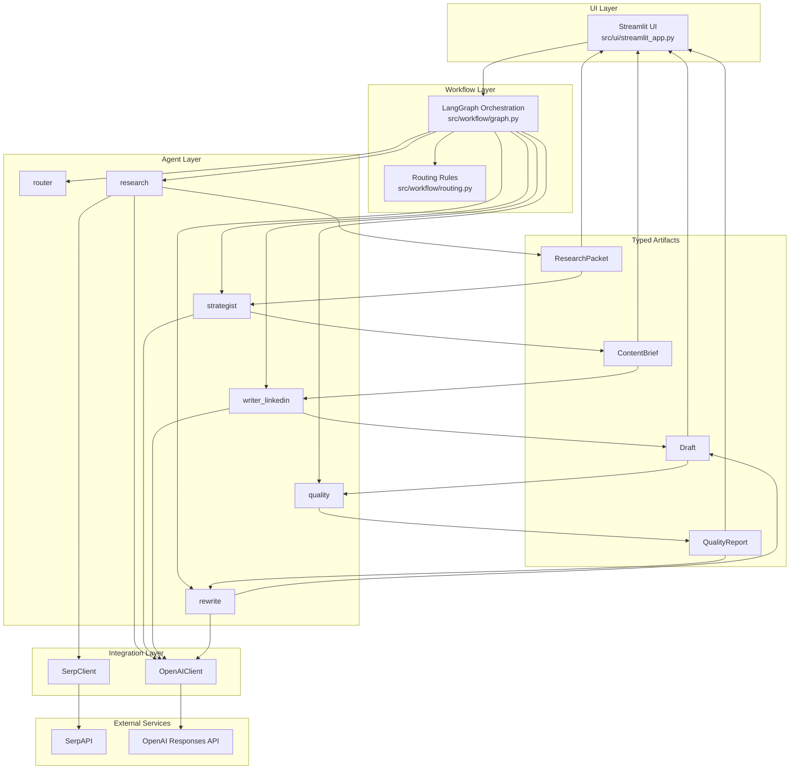
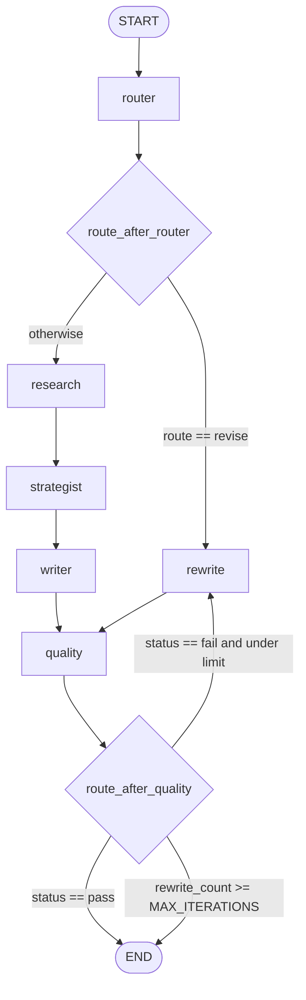

# Architecture

## Overview

AI Content Marketing Assistant is a Streamlit-driven, LangGraph-orchestrated multi-agent system for generating citation-aware marketing content. The application collects research, transforms it into a structured brief, produces a platform-specific draft, validates quality deterministically, and loops through rewrite when needed until the output passes or the configured rewrite limit is reached.

## Layered Architecture



- The Streamlit UI submits typed state into the LangGraph runtime.
- The workflow layer decides whether to follow the create path or jump directly into rewrite for revision.
- Each agent returns structured data that is validated against Pydantic models before re-entering state.
- Integration clients isolate network access and make external dependencies easy to mock in tests.

## LangGraph Workflow



- In the create flow, the router sends execution into `research`, then `strategist`, then `writer`, and finally `quality`.
- In the revise flow, the router sends execution directly to `rewrite`, which uses the existing draft and revision request before re-entering quality.
- The quality gate either ends the run, or loops back into rewrite until the draft passes or `MAX_ITERATIONS` is reached.

## State Model (AppState)

Key state fields currently used by the application:

- `topic`
- `audience`
- `platform`
- `intent`
- `route`
- `revision_request`
- `rewrite_count`
- `research`
- `brief`
- `draft`
- `quality_report`
- `errors`
- `meta`

Artifact boundaries are schema-validated with Pydantic:

- `research` is validated as `ResearchPacket`
- `brief` is validated as `ContentBrief`
- `draft` is validated as `Draft`
- `quality_report` is validated as `QualityReport`

## Runtime Sequences

### Create: Run New Draft

1. The user enters a topic and audience in Streamlit and clicks `Run new draft`.
2. The UI sends initial state into the LangGraph workflow with `intent="create"`.
3. The router selects the standard create path.
4. `research` collects sources, summarizes findings, and returns a `ResearchPacket`.
5. `strategist` converts the research into a `ContentBrief`.
6. `writer_linkedin` generates a `Draft` constrained to approved citation URLs.
7. `quality` evaluates the draft against deterministic heuristics.
8. If the draft fails, `rewrite` revises it and the workflow loops back through quality until pass or limit.
9. The final research, brief, draft, and quality report are rendered in the UI.

### Revise: Revise Last Draft

1. The user clicks `Revise last draft` after a prior run exists in session state.
2. The UI reuses the last workflow state and adds a `revision_request`.
3. The router detects revise intent and jumps directly to `rewrite`.
4. `rewrite` adjusts the existing draft using the current quality fixes and revision request.
5. `quality` re-evaluates the revised draft.
6. The workflow loops between rewrite and quality until the draft passes or reaches `MAX_ITERATIONS`.
7. The updated artifacts are rendered back into the UI.

## Quality Gate + Rewrite Loop

The current deterministic quality checks include:

- citations present in research
- citations used in the draft
- maximum word count if `constraints.max_words` is configured
- headline length (12 words or fewer)
- CTA present in the draft body
- LinkedIn skimmability via blank-line-separated paragraphs

The rewrite path also performs deterministic post-processing after LLM or fallback generation:

- appends the CTA to the body if it is missing
- reflows text into at least three paragraphs when needed

This keeps the rewrite loop reliable even if the model response is imperfect.

## Deterministic Testing Strategy

The test suite is intentionally offline and deterministic:

- `OpenAIClient.complete_json` is monkeypatched in unit tests
- `SerpClient.search` and `requests.get` are monkeypatched in unit tests
- Tests validate Pydantic schemas for all major artifact types
- Graph tests exercise routing and loop behavior without real network calls

Run the full suite with:

```bash
uv run pytest -q
```

## File Map

- `src/agents/*.py`: agent nodes for routing, research, strategy, writing, quality, and rewrite
- `src/integrations/*.py`: wrappers for OpenAI Responses API and SerpAPI
- `src/workflow/*.py`: graph construction and conditional routing logic
- `src/ui/streamlit_app.py`: Streamlit application for create and revise workflows
- `tests/`: deterministic unit tests covering integrations, agents, models, and workflow behavior
