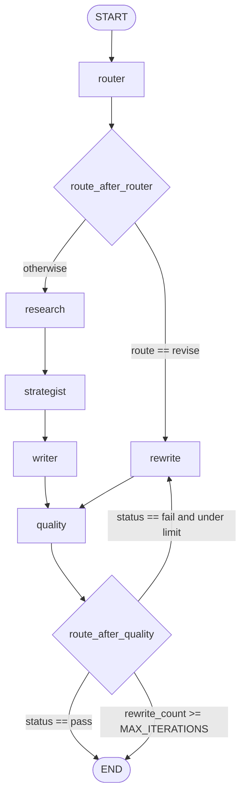

# Workflow Graph

```mermaid
flowchart TD
    start([START]) --> router[router]

    router --> router_check{route_after_router}
    router_check -->|route == revise| rewrite[rewrite]
    router_check -->|otherwise| research[research]

    research --> strategist[strategist]
    strategist --> writer[writer]
    writer --> quality[quality]

    rewrite --> quality

    quality --> quality_check{route_after_quality}
    quality_check -->|status == pass| finish([END])
    quality_check -->|rewrite_count >= MAX_ITERATIONS| finish
    quality_check -->|status == fail and under limit| rewrite
```

This reflects the current LangGraph wiring in `src/workflow/graph.py` and the routing logic in `src/workflow/routing.py`.
